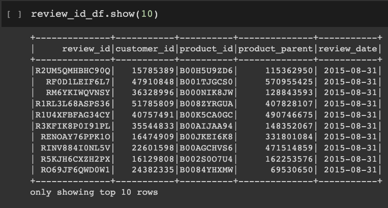

# Amazon_Vine_Analysis

## Overview of the analysis:
The purpose of this project is to analyze written Amazon Reviews by members of the paid
Amazon Vine program and determine if there is any biases in the Vine reviews. In this case,
we will be analyzing reviews of Amazon Tools in the US.

## Results:
Our first step was to extract the amazon dataset

Then create tables to load into our Postgres SQL database on AWS

Lastly, we upload the tables into Postgres in AWS

With the data ready, we can then run queries to determine

- How many Vine reviews and non-Vine reviews are there?
- How many Vine reviews were 5 stars? How many non-Vine reviews were 5 stars?
- What percentage of Vine reviews were 5 stars?
- What percentage of non-Vine reviews were 5 stars?

## Summary:
In summary, there are:
- 31,827 helpful reviews total
- 285 of the reviews are Vine reviews
- 31,542 of the reviews are non-Vine reviews
- 14,777 of the reviews are 5-star reviews
- 163 of the 5-star reviews are Vine reviews
- 14,614 of the 5-star reviews are non-Vine reviews
- The percent of Vine 5-star reviews is 1.10%
- The percent of non-Vine 5-star reviews is 98.90%